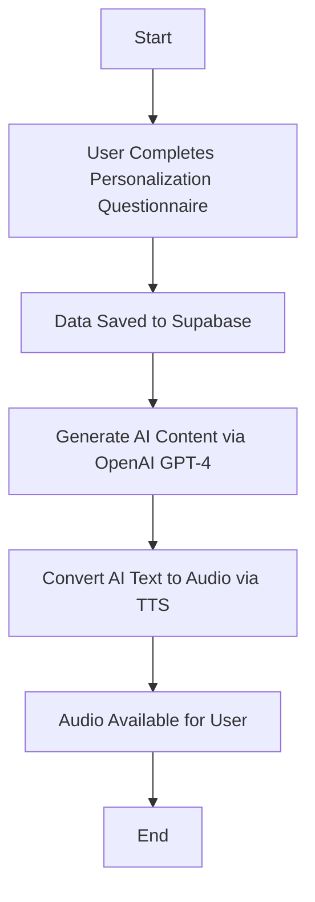

# TTS Audiobook Project

# AI Audio Playground MVP

## Vision Statement
Our vision is to empower individuals with personalized audio experiences by leveraging cutting-edge AI and Text-to-Speech (TTS) technologies. We aim to create a platform that generates tailored audiobooks and affirmations, enhancing personal growth and self-improvement through customized content that aligns with each user's unique goals and preferences.

## Project Overview

### Problem Statement
Many individuals seeking self-improvement, learning, or motivational content find existing audio solutions lacking in personalization and flexibility. Generic audiobooks and affirmations often fail to address specific personal goals, challenges, and preferences, limiting their effectiveness and user engagement.

### Solution
Our platform addresses this gap by utilizing AI and TTS technologies to generate personalized audiobooks and affirmations. By capturing detailed user inputs through a personalization questionnaire, we create customized content that resonates with individual needs. The Playground MVP serves as a dynamic environment to iterate on onboarding processes, refine AI content generation, and evaluate TTS outputs, ensuring high-quality, tailored audio experiences that enhance user satisfaction and engagement.

## User Stories & Features

### Target Users
- **Self-Improvement Enthusiasts:** Individuals seeking personalized audiobooks and affirmations to support their personal growth, tailored to their specific goals and challenges.
- **Content Creators and Coaches:** Professionals who want to provide customized audio materials to their clients, enhancing their service offerings with personalized content.

### Core Features

1. **Personalization Questionnaire**
   - **Description:** A dynamic form that captures user inputs such as goals, challenges, and preferences.
   - **User Benefit:** Ensures the generated audio content is highly relevant and personalized to each user's unique needs.
   - **Technical Considerations:** Implementation of dynamic form fields and real-time prompt generation based on user inputs.

2. **AI Content Generation**
   - **Description:** Utilizes OpenAI GPT-4 to generate personalized text content based on user inputs, with support for additional AI providers like Claude and Cohere.
   - **User Benefit:** Delivers high-quality, customized content that aligns with user-specific goals and preferences.
   - **Technical Considerations:** API integration, prompt management, and modular architecture to support multiple AI providers.

3. **Text-to-Speech Conversion**
   - **Description:** Converts AI-generated text into audio using OpenAI TTS, with a modular design to integrate future providers like Play.ht and ElevenLabs.
   - **User Benefit:** Provides users with an audio format of their personalized content, enhancing accessibility and convenience.
   - **Technical Considerations:** Handling audio file generation, storage, and playback; ensuring seamless integration with multiple TTS providers.

4. **Playground for Testing**
   - **Description:** A dashboard that allows admins and testers to experiment with onboarding flows, AI prompts, and TTS outputs, enabling comparison between different AI and TTS providers.
   - **User Benefit:** Facilitates continuous improvement and refinement of content generation and user onboarding processes.
   - **Technical Considerations:** User-friendly UI for testing different configurations, data management for storing test results, and comparison tools for evaluating provider performance.

5. **Modular Design**
   - **Description:** An architecture that allows for the seamless addition of new AI and TTS providers, ensuring scalability and flexibility.
   - **User Benefit:** Enables the platform to grow and adapt to new technologies and user needs without significant reengineering.
   - **Technical Considerations:** Clear interfaces and dependency injection for integrating new providers, maintaining separation of concerns.

### User Flows

#### Primary Flow: Personalized Self-Help Onboarding and Content Generation


#### Detailed Onboarding Flow

**Personalized Self-Help Onboarding**

1. **Introduction**
   - **Action:** User clicks ▶️ to listen to the introduction.
   - **Alternative:** User can read the introduction transcript provided below.
   - **Components:**
     - Audio player for introduction.
     - Toggle to switch between audio and transcript.

2. **About You**
   - **Questions:**
     - What is your name?
     - How old are you?
     - What is your sex?
     - What is your occupation?
     - What is your current living situation? (e.g., single, married, living with partner, have children)

3. **Your Strengths**
   - **Question:** What do you, or ones close to you, consider to be your top 3 strengths? Try to give examples of them in action as well.

4. **Personal Growth Journey**
   - **Instructions:** Provide detailed information about the areas of your life where you're seeking growth, change, or knowledge.
   - **For Each Topic (1-6):**
     - Describe the current challenge or situation.
     - Explain why this is important to you.
     - Share any specific goals you have related to this area.
     - Describe how this challenge makes you feel emotionally.
     - Share a brief personal anecdote or example related to this challenge.
     - Describe what success would look like in this area.
     - Mention any techniques or approaches you've tried before.
   - **Optional Topics:** Topic 5 and Topic 6.
   - **Additional Questions:**
     - Do you wish for each section described above to have similar weighting/length in the book, or would you like us to ensure more focus/time is spent on specific topics? Please indicate which topic(s) you would like the most weighting and feel free to express how much extra weighting.
     - Do you have a preference for the order in which these topics are addressed in the audiobook, or are you happy for the AI to determine the best flow?

5. **Daily Life and Routines**
   - **Questions:**
     - Please describe your current daily routine.
     - What would your ideal daily routine look like?
     - Are there any specific habits you're trying to build or break that you haven't mentioned earlier?

6. **Learning Style and Preferences**
   - **Questions:**
     - Are there any specific techniques, theories, approaches, self-help books, authors, or experts whose work has particularly resonated with you in the past? Please share why you found them helpful or interesting.
     - What type of voice and tone do you prefer for your audiobook? Please specify gender, accent, and style.

7. **Final Thoughts**
   - **Question:** Is there anything else you'd like to share that would help us create a truly personalized and impactful audiobook for you?

## Technical Architecture

### Technology Stack

#### Frontend
- **Framework:** Next.js (App Router)
  - **Reasoning:** Provides modern file-based routing, server-side rendering, and static generation capabilities, essential for building a scalable and performant frontend.
  - **Key Features:** Server-side rendering, static site generation, API routes, dynamic routing.
- **UI Library:** Tailwind CSS
  - **Reasoning:** Offers utility-first styling, enabling rapid UI development with a consistent design system.
- **State Management:** Zustand
  - **Reasoning:** Lightweight and easy-to-use state management library, suitable for managing global state in the application.
- **Data Fetching:** TanStack Query
  - **Reasoning:** Efficiently handles server-state management, caching, and data synchronization.

#### Backend
- **Platform:** Supabase
  - **Reasoning:** Provides a robust backend-as-a-service solution with authentication, database, and serverless functions, streamlining development.
- **API Style:** RESTful API
  - **Reasoning:** Simple and widely adopted approach for building APIs, ensuring compatibility and ease of integration.
- **Key Services:**
  - **Supabase Auth:** Manages user authentication and authorization.
  - **Supabase Database:** Stores user data, generated content, and configuration settings.
  - **Serverless Functions:** Handle AI content generation and TTS conversion through API routes.

#### Database
- **Provider:** Supabase (PostgreSQL)
- **Schema Overview:**
  ```sql
  -- Users Table
  CREATE TABLE users (
      id UUID PRIMARY KEY,
      email TEXT UNIQUE NOT NULL,
      name TEXT,
      age INT,
      sex TEXT,
      occupation TEXT,
      living_situation TEXT,
      strengths JSONB,
      personal_growth JSONB,
      daily_routines JSONB,
      learning_preferences JSONB,
      final_thoughts TEXT,
      created_at TIMESTAMP DEFAULT NOW()
  );

  -- Generated Content Table
  CREATE TABLE generated_content (
      id UUID PRIMARY KEY,
      user_id UUID REFERENCES users(id),
      prompt TEXT,
      ai_provider TEXT,
      tts_provider TEXT,
      generated_text TEXT,
      audio_url TEXT,
      created_at TIMESTAMP DEFAULT NOW()
  );

  -- Prompts Table
  CREATE TABLE prompts (
      id UUID PRIMARY KEY,
      template TEXT,
      description TEXT,
      created_at TIMESTAMP DEFAULT NOW()
  );
  ```

#### Infrastructure
- **Hosting:** Replit for MVP deployment, Supabase Storage for managing and serving audio files.
- **CI/CD:** GitHub Actions for continuous integration and deployment.
- **Monitoring:** Sentry for error tracking and performance monitoring.

### Security & Performance
- **Authentication:** Supabase Auth provides secure and reliable authentication methods, including email/password and social logins.
- **Data Protection:** 
  - **Encryption:** Data is encrypted both at rest and in transit.
  - **Backup Strategy:** Regular backups are scheduled to prevent data loss.
- **Performance Optimizations:**
  - **Caching:** Implement caching strategies for API responses and static assets.
  - **Efficient API Usage:** Optimize API calls to minimize latency and reduce costs.

## Development Roadmap

### Phase 1: Foundation
**Objective:** Establish the foundational elements of the project, setting up the development environment, repository, and core dependencies to ensure a smooth development process.

#### Tasks
1. **Project Setup**
   - **Repository Initialization**
     - Create a new GitHub repository named `ai-audio-playground-mvp`.
     - Initialize with a `README.md`, `.gitignore`, and appropriate licensing (`MIT`).
   - **Development Environment Setup**
     - Configure the local development environment with necessary tools (Node.js, npm).
     - Set up code editors and extensions (e.g., VSCode with ESLint, Prettier).
   - **Core Dependencies Installation**
     - Install Next.js, React, Tailwind CSS, Zustand, TanStack Query, Axios, TypeScript, ESLint, Prettier, etc.
     - Configure `tsconfig.json` for TypeScript.
     - Set up ESLint and Prettier configurations for consistent code styling.

2. **Supabase Configuration**
   - **Create Supabase Project**
     - Sign up/log in to Supabase and create a new project.
     - Obtain the Supabase URL and Anon Key.
   - **Database Setup**
     - Use the provided SQL schema to create necessary tables (`users`, `generated_content`, `prompts`).
     - Configure Supabase Storage for audio file management.
   - **Authentication Setup**
     - Enable email/password authentication and configure social logins if needed.

3. **Initial Next.js Setup**
   - **Initialize Next.js App**
     - Create the Next.js app with the App Router.
     - Set up the basic folder structure as outlined in the project documentation.
   - **Integrate Tailwind CSS**
     - Configure Tailwind CSS with Next.js.
     - Create a base `globals.css` file with Tailwind directives.
   - **Set Up Zustand for State Management**
     - Initialize Zustand stores for authentication and user data.

4. **CI/CD Pipeline**
   - **GitHub Actions Setup**
     - Create GitHub Actions workflows for linting, testing, and deployment.
     - Ensure automated checks on pull requests.

#### Success Criteria
- Repository is set up with the initial project structure.
- Development environment is configured and running successfully.
- All core dependencies are installed without errors.
- Supabase is configured with the necessary tables and authentication methods.
- Initial Next.js app is running locally with Tailwind CSS integrated.
- CI/CD pipeline is operational, ensuring code quality and automated deployments.

### Phase 2: Core Features
**Objective:** Develop and implement the core features essential for the MVP, focusing on the personalization questionnaire, AI content generation, TTS conversion, and the playground dashboard.

#### Tasks

**Feature Set A: Personalization Questionnaire**
- **User Story:** As a new user, I want to complete a detailed questionnaire so that the platform can generate personalized audio content tailored to my needs.
- **Tasks:**
  1. **Design Onboarding Form UI**
     - Create React components for each section of the onboarding questionnaire.
     - Ensure the form is user-friendly and responsive.
  2. **Implement Form Functionality**
     - Capture user inputs and validate data.
     - Dynamically expand text areas for detailed responses.
  3. **Integrate with Supabase**
     - Save user responses to the `users` table in Supabase.
     - Handle form submission and error states.
  4. **Prompt Generation**
     - Develop logic to convert user inputs into AI prompts for content generation.
     - Store prompt templates in the `prompts` table.

**Feature Set B: AI Content Generation**
- **User Story:** As a user, I want the platform to generate personalized text content based on my questionnaire responses so that I can receive tailored audio materials.
- **Tasks:**
  1. **Implement Serverless Function for OpenAI GPT-4**
     - Create an API route (`/api/generate`) to handle content generation requests.
     - Integrate OpenAI GPT-4 API for generating text based on prompts.
  2. **Develop Prompt Management UI**
     - Allow admins/testers to create, edit, and manage AI prompts.
     - Enable real-time preview of generated content.
  3. **Handle AI Provider Selection**
     - Implement functionality to switch between different AI providers (e.g., OpenAI GPT-4, Claude, Cohere).
     - Ensure the system is modular to accommodate future AI integrations.

**Feature Set C: Text-to-Speech Conversion**
- **User Story:** As a user, I want my personalized text content to be converted into audio so that I can listen to my tailored audiobook or affirmations.
- **Tasks:**
  1. **Integrate OpenAI TTS**
     - Create an API route (`/api/tts`) to handle TTS conversion requests.
     - Connect with OpenAI TTS API to convert text to audio.
  2. **Develop Audio Playback Component**
     - Create a React component to play generated audio files.
     - Ensure compatibility across different browsers and devices.
  3. **Enable TTS Provider Switching**
     - Allow admins/testers to select different TTS providers (e.g., OpenAI TTS, Play.ht, ElevenLabs).
     - Maintain a modular architecture to support multiple TTS integrations.

**Feature Set D: Playground Dashboard**
- **User Story:** As an admin/tester, I want to experiment with different onboarding flows, AI prompts, and TTS outputs so that I can refine the content generation and user experience.
- **Tasks:**
  1. **Create Dashboard Interface**
     - Design and implement a user-friendly dashboard for testing purposes.
     - Include sections for onboarding flow management, prompt editing, and TTS configuration.
  2. **Implement Comparison Tools**
     - Enable comparison between different AI and TTS providers.
     - Display side-by-side results for easy evaluation.
  3. **Data Management**
     - Store test results and configurations in Supabase.
     - Provide tools for reviewing and analyzing test data.

#### Success Criteria
- All core features are implemented and functioning.
- Users can complete the onboarding process, generate personalized content, and listen to the audio outputs.
- Playground dashboard allows for effective testing and iteration.
- Ability to switch and edit AI and TTS providers within the playground is operational.

### Phase 3: Enhancement
**Objective:** Enhance the platform by integrating additional AI and TTS providers, optimizing performance, and implementing advanced features based on user feedback.

#### Tasks

**Advanced Features**
- **User Story:** As a user, I want access to a variety of AI and TTS providers so that I can choose the best option for my personalized audio content.
- **Tasks:**
  1. **Integrate Additional AI Providers**
     - Add support for AI providers like Claude and Cohere.
     - Update the API routes and UI to allow selection and management of multiple AI providers.
  2. **Add More TTS Providers**
     - Integrate TTS providers such as Play.ht and ElevenLabs.
     - Ensure seamless switching and testing between different TTS services.

**Performance Optimization**
- **User Story:** As a user, I want the platform to perform efficiently so that I can receive my personalized audio content quickly and reliably.
- **Tasks:**
  1. **Implement Caching Strategies**
     - Cache API responses and static assets to reduce load times.
     - Utilize Next.js built-in caching mechanisms and external caching services if necessary.
  2. **Optimize API Calls**
     - Minimize the number of API calls to reduce latency and costs.
     - Implement batching and debouncing techniques where applicable.
  3. **Improve Audio File Management**
     - Optimize storage and retrieval of audio files in Supabase Storage.
     - Implement CDN for faster audio delivery.

**User Feedback and Iteration**
- **User Story:** As a product manager, I want to gather and implement user feedback to continuously improve the platform.
- **Tasks:**
  1. **Collect User Feedback**
     - Implement feedback forms and surveys within the platform.
     - Analyze user behavior and usage patterns.
  2. **Refine Onboarding Flows**
     - Adjust the personalization questionnaire based on user input.
     - Enhance user experience and interface design for better engagement.
  3. **Enhance Content Generation**
     - Fine-tune AI prompts for more accurate and relevant content.
     - Improve TTS quality based on user preferences and feedback.

#### Success Criteria
- Platform supports multiple AI and TTS providers.
- Performance metrics meet predefined benchmarks (e.g., reduced load times, efficient API usage).
- User feedback is positive, indicating improved experience and functionality.
- Advanced features are stable and add significant value to the platform.

## Development Guide

### Prerequisites and Dependencies

#### Core Dependencies
```bash
# Core framework
next@14.0.0
react@18.2.0
react-dom@18.2.0

# UI and Styling
tailwindcss@3.3.0
@headlessui/react@1.7.17
@heroicons/react@2.0.18

# State Management
zustand@4.4.7

# API and Data Fetching
@tanstack/react-query@5.13.4
axios@1.6.2

# Development Tools
typescript@5.3.3
eslint@8.55.0
prettier@3.1.1
```

#### External Services Setup
1. **Authentication (Supabase Auth)**
   ```env
   NEXT_PUBLIC_SUPABASE_URL=your_supabase_url
   NEXT_PUBLIC_SUPABASE_ANON_KEY=your_supabase_anon_key
   SUPABASE_SERVICE_ROLE_KEY=your_supabase_service_role_key
   ```

2. **AI Content Generation (OpenAI)**
   ```env
   OPENAI_API_KEY=your_openai_api_key
   ```

3. **Text-to-Speech (OpenAI TTS)**
   ```env
   OPENAI_TTS_API_KEY=your_openai_tts_api_key
   ```

4. **Additional Services**
   - **Supabase Storage Configuration**
   - **API Keys for Future Providers (e.g., Play.ht, ElevenLabs)**
   - **Service Configurations and Required Accounts**

### Modular Development Guidelines

#### 1. Component Structure
```
/components
├── common/                # Reusable UI components
│   ├── Button/
│   │   ├── index.tsx
│   │   ├── types.ts
│   │   └── styles.ts
│   ├── Input/
│   │   ├── index.tsx
│   │   ├── types.ts
│   │   └── styles.ts
│   └── ...
├── features/              # Feature-specific components
│   ├── auth/
│   │   ├── LoginForm.tsx
│   │   └── RegisterForm.tsx
│   ├── onboarding/
│   │   ├── OnboardingForm.tsx
│   │   └── OnboardingSuccess.tsx
│   ├── playground/
│   │   ├── PlaygroundDashboard.tsx
│   │   └── AudioPlayer.tsx
│   └── ...
└── layouts/               # Page layouts
    ├── MainLayout.tsx
    └── AuthLayout.tsx
```

#### 2. Module Development Rules
- **Self-Contained Features:** Each feature should encapsulate its own components, styles, and logic.
- **Dependency Injection:** Use dependency injection for integrating services like AI and TTS providers.
- **Clear Interfaces:** Define and implement clear interfaces between modules to ensure seamless interaction.
- **Single Responsibility Principle:** Each module should have a single responsibility to enhance maintainability and scalability.

#### 3. State Management
```typescript
// Example store structure
/stores
├── auth.store.ts
├── onboarding.store.ts
├── playground.store.ts
└── index.ts
```

### Environment Setup
```bash
# Clone repository
git clone https://github.com/your-repo/ai-audio-playground-mvp.git

# Navigate to project directory
cd ai-audio-playground-mvp

# Install dependencies
npm install

# Set up environment variables
cp .env.example .env

# Open .env and replace placeholders with your actual keys
```

### Environment Variables
```env
# Core Configuration
NODE_ENV=development
NEXT_PUBLIC_API_URL=http://localhost:3000

# Supabase
NEXT_PUBLIC_SUPABASE_URL=your_supabase_url
NEXT_PUBLIC_SUPABASE_ANON_KEY=your_supabase_anon_key
SUPABASE_SERVICE_ROLE_KEY=your_supabase_service_role_key

# OpenAI
OPENAI_API_KEY=your_openai_api_key
OPENAI_TTS_API_KEY=your_openai_tts_api_key

# Feature Flags
ENABLE_PLAYGROUND=true
ENABLE_ADVANCED_TTS=false
```

### Project Structure
```
/
├── app/                     # Next.js app directory
│   ├── layout.tsx           # Root layout
│   ├── page.tsx             # Home page
│   ├── onboarding/          # Onboarding routes
│   │   └── page.tsx
│   ├── playground/          # Playground routes
│   │   ├── page.tsx
│   │   └── [sessionId]/     # Dynamic route for test results
│   │       └── page.tsx
│   └── api/                 # API routes
│       ├── generate/
│       │   └── route.js     # AI content generation
│       └── tts/
│           └── route.js     # TTS conversion
├── components/              # React components
├── lib/                     # Utility functions
│   ├── supabase.js          # Supabase client setup
│   ├── api.js               # API call helpers
│   └── utils.js             # General utilities
├── stores/                  # State management
├── types/                   # TypeScript types
├── styles/                  # Global and component-specific styles
│   └── globals.css
├── public/                  # Static assets
│   └── audio/               # Placeholder for generated audio files
├── data/                    # Example prompts and test data
│   └── prompts/
└── README.md                # Project documentation
```

### Development Workflow

1. **Branch Naming Convention**
   - **Feature Branches:** `feature/feature-name`
   - **Bug Fixes:** `bugfix/bug-description`
   - **Hotfixes:** `hotfix/issue-description`
   - **Release Branches:** `release/version-number`

2. **Commit Message Format**
   - **Format:** `type(scope): description`
   - **Examples:**
     - `feat(onboarding): add personalization questionnaire`
     - `fix(playground): resolve audio playback issue`
     - `chore(deps): update React to v18.2.0`

3. **Pull Request (PR) Process**
   - **Create PR:** When a feature or fix is complete, create a PR from the respective branch to `main`.
   - **Review:** At least one team member must review and approve the PR.
   - **Merge:** After approval, the PR can be merged into `main`.
   - **Close Branch:** Delete the feature/fix branch after merging.

4. **Code Review Guidelines**
   - **Readability:** Ensure code is clean, well-commented, and follows consistent styling.
   - **Functionality:** Verify that the code meets the feature requirements and functions correctly.
   - **Best Practices:** Check for adherence to best practices in coding standards, security, and performance.
   - **Testing:** Ensure adequate testing is in place for new features or fixes.

## Learning Resources

### Core Documentation
```markdown
# Next.js Core Concepts
- [App Router](https://nextjs.org/docs/app)
- [Server Components](https://nextjs.org/docs/getting-started/react-essentials)
- [Data Fetching](https://nextjs.org/docs/app/building-your-application/data-fetching)

# Supabase Documentation
- [Getting Started with Supabase](https://supabase.com/docs)
- [Supabase Auth](https://supabase.com/docs/guides/auth)
- [Supabase Database](https://supabase.com/docs/guides/database)

# OpenAI API Documentation
- [OpenAI GPT-4](https://beta.openai.com/docs/)
- [OpenAI TTS](https://beta.openai.com/docs/api-reference/text-to-speech)

# State Management
- [Zustand Guide](https://docs.pmnd.rs/zustand/getting-started/introduction)
- [React Query Overview](https://tanstack.com/query/latest/docs/react/overview)

# UI Components
- [Tailwind CSS](https://tailwindcss.com/docs)
- [HeadlessUI Components](https://headlessui.com/)
- [Heroicons](https://heroicons.com/)
```

### Tutorials & Guides
- [Building a Next.js App with Supabase](https://supabase.com/blog/build-nextjs-app)
- [Integrating OpenAI GPT-4 with Next.js](https://beta.openai.com/docs/integrations)
- [Using Tailwind CSS in Next.js](https://tailwindcss.com/docs/guides/nextjs)
- [State Management with Zustand](https://zustand-demo.pmnd.rs/)
- [Implementing Audio Playback in React](https://developer.mozilla.org/en-US/docs/Web/HTML/Element/audio)

### Community & Support
- **Discord:** [Join our Discord community](https://discord.gg/your-community-link)
- **GitHub Discussions:** [Participate in GitHub Discussions](https://github.com/your-repo/ai-audio-playground-mvp/discussions)

---

## Getting Started

### Prerequisites
- **Node.js:** Ensure you have Node.js installed (v14 or later).
- **npm:** Comes with Node.js, or use Yarn if preferred.
- **Supabase Account:** Sign up for a Supabase account and create a new project.
- **OpenAI Account:** Obtain API keys from OpenAI for GPT-4 and TTS services.

### Installation

1. **Clone the Repository**
   ```bash
   git clone https://github.com/your-repo/ai-audio-playground-mvp.git
   cd ai-audio-playground-mvp
   ```

2. **Install Dependencies**
   ```bash
   npm install
   ```

3. **Configure Environment Variables**
   - Rename `.env.example` to `.env` and fill in your credentials.
   ```bash
   cp .env.example .env
   ```
   - Open `.env` and replace the placeholder values with your actual API keys and URLs.

4. **Run the Development Server**
   ```bash
   npm run dev
   ```
   - Open [http://localhost:3000](http://localhost:3000) in your browser to see the application.

### Building for Production
```bash
npm run build
npm start
```

### Testing
- **Unit Tests:** Implement using Jest or your preferred testing framework.
- **Integration Tests:** Ensure all components and services work seamlessly together.
- **Manual Testing:** Verify user flows and feature functionalities manually.

---

## Contribution Guidelines
We welcome contributions from the community! To contribute, please follow these steps:

1. **Fork the Repository**
2. **Create a Feature Branch**
   ```bash
   git checkout -b feature/your-feature-name
   ```
3. **Commit Your Changes**
   ```bash
   git commit -m "feat(feature-name): add new feature"
   ```
4. **Push to the Branch**
   ```bash
   git push origin feature/your-feature-name
   ```
5. **Open a Pull Request**

Please ensure your code follows the established style guidelines and includes appropriate tests.

---


Thank you for contributing to the AI Audio Playground MVP! We look forward to building a transformative personalized audio experience together.